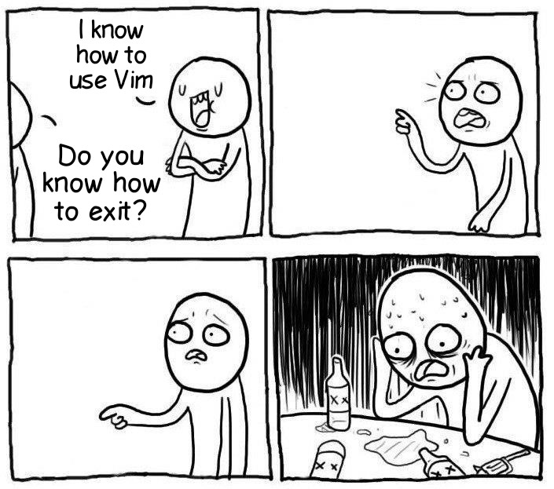

# vim
<center>

</center>

# Table of content
- [Introduction to vim](#introduction-to-vim)
- [Working with vim (overview)](#overview-of-using-vim)
- [Basic Commands](#basic-commands)
- [Some Usefull tricks](#tricks)


# Introduction to vim
- [What is vim?](#what-is-vim)
- [The diffrence between **vi** and **vim**](#vim-vs-vi)
- [Why shoud we use vim?](#why-shoud-we-use-vim)

## What is vim?
Vim is a powerfull *text editor*. It's useful for programmers and others actually.
And does a lot of things for us as common editors can do, like *Editing all kind of plain text file*. and especially useful for editing *programs/codes* and so on

so vim is not a graphical editor like `vscode` and other editor. it based on *text* and the mouse is not longer need to interactive around vim. (there is a graphical version of vim: `gvim`)

and for working with vim and do your own actions we use `commands`. for example for saving the file we use `:w[rite]` command or for going out of file we can use `:q[uit
]` command and so on. we check them soon

for more information you can see the *man page* of vim

```bash
$ man vim
```
This page gives you a lot of information that you can read.
```
NAME
       vim - Vi IMproved, a programmer's text editor
...

DESCRIPTION
       Vim  is a text editor that is upwards compatible to Vi.  It can be used
       to edit all kinds of plain text.  It is especially useful  for  editing
       programs.

       There  are a lot of enhancements above Vi: multi level undo, multi win‐
       dows and buffers, syntax highlighting, command line  editing,  filename
       completion,   on-line   help,   visual  selection,  etc..   See  ":help
       vi_diff.txt" for a summary of the differences between Vim and Vi.
       ...
```

## Vim *vs* vi
Vi is the orignial standard UNIX text-editor. 
vim is **VI Improved** the advanced version of the *vi* and we can say the improved version of *vi* or whatever.

in most modern system `vi` has been replaced with `vim`

```bash
$ which vim
/usr/bin/vim
$ readlink /usr/bin/vim
/etc/alternatives/vim
$ readlink /etc/alternatives/vim
/usr/bin/vim.basic
$ which vi
/usr/bin/vi
$ readlink /usr/bin/vi
/etc/alternatives/vi
$ readlink /etc/alternatives/vi
/usr/bin/vim.basic
```

Both of `vim` and `vi` execute the `/usr/bin/vim.basic` program

also for more information you can see the differences between vi and vim the command `:help vi_diff.txt` will display the diffrences.

# Why shoud we use vim?
so anyway, why should we use the `vim`. so let's check this out


So, if you know the vim or let's say `text based editor` like `nano` or so.

Imagine a day that you have to edit a file in a server. so what you should do, just connect to server via `ssh` then edit the file. so as you already know we cannot use graphical editors to edit in server(ofcourse we can but in hard way. like using the `Remote SSH` extenstion in `vscode` we can ssh to server via `vscode` editor). But let's dont do that we need a simple way just for editing a simple file we can use `vim` and `nano` or so.

Also vim saves more times. if you can type fast and you can intreract with vim. so good for you, Because your hands is on the keyboard only, and they are closer to each other to working (mouse is no longer need)

>**For FUN**: using vim gives this idea that i'm an expert :) no i'm kidding. it is just a tool and does not really important. 

OK let's jump into the *working with vim*

## Overview of using vim

so let's talk about the vim basics. just an overview of using vim.

```bash
$ vim file.txt
```

This will open the file if does not exists: open the file in `swap` space.

### Vim modes
- **Normal**: The default mode in vim. *Command* mode is the default mode
- **Command**: This mode is very important mode. In this mode we cannot type text and only we access the vim commands that there are a lot of commands/shortcuts that we can use them.
- **Insert**: In this mode we can edit file like any editor. using keyboard to write text.
- **Visual**: In this mode we can select a block of text in file. select [multiple line/a block of line]
- **Replace**: In this mode we can replace the text

Each mode has its own property and particular behaviour.

## common commands:
- **i**: insert mode
- **Esc**: back to normal mode
- **:q**: quit the file
- **:q!**: force to quit
- **:w!**: write the file: save
- **:wq!**: write then quite of file.

:tada: Congratuation: now you can exit of the vim
anybody can not exit the vim currently. bu you can :)



Ok very well let's jump into the vim commands that everyone need to know.

## Basic Commands
Now we are going to look at some important and useful commands.

- [Navigation commands](#navigation-commands)
- [Insert/Append/Editing](#insertappend)
- [Cut/Paste/Delete](#cutpastedelete)
- [Visual Mode](#visual-mode-so-cool)
- [Search and subsitute](#search-and-subsitute)
- [some commands to write and quit the file](#some-commands-to-writequite-of-the-vim)

### Navigation commands
- **h, j ,k, l**: Move cursor: [left: **h**, down: **j**, up: **k**, right: **l**]
- **Ctrl+y, Ctrl+e**: Scrollin the page
- **:(line-number)**: go specific line
- **gg, 5gg**: Go the a top of file, and go to specific line 
- **G, 5G**: Got the button of file and specific line
- **}, {**: Move to next and previous paragraph
- **^, $**: first and last of a line
- **H, M, L**: Top/Middle/Button of screen
- **w, W**: go to first character of the next word
- **e, E**: go to end of the current word
- **b, B**: go to before word
- **f(c), t(c), F(c), T(c)**: Go to specific character in line

### Insert/Append
- **i, a, I, A, o, O**: insert mode/append/new line
- **r, R**: replace
- **J, gJ**: Join bellow line
- **u, U**: Undo the previose changed
- **Ctrl+r**: Redo the last change
- **:m +-(num) , :m line**: move the line

### Cut/Paste/Delete
- **dd, 4dd, d$, d}, dw**: delete and copy in vim *clipboard*
- **yy, 4yy, y$, y{, yw**: yank without deleting also copy to *clipboard*
- **x, X**: delete a character and copy to clipboard
- **p, P, xp**: paste/put the copied text

### Visual mode. so cool
- **v**: visual mode
- **Ctrl+v**: visual block
- **V**: visual line
- **>>, <<**: Indentation/Shift
- **u,U,~**: Change case

### Search and subsitute
- **/pattern**: search after cursur
- **?pattern**: search before cursur
- **n, N**: go next
- **[%]s/foo/bar**: replace all `foo` with `bar`

### Some commands to write/quite of the vim
- **:q!, ZQ**: just quit of file without writing
- **:w!**: write the file
- **:wq! ZZ**: write file then quit of the file

## Tricks
- **:set**:  set the config and settings of vim
- **:set number/nonumber**
- **:colorscheme theme**: change the theme of the vim
- **:term[inal]**: open a terminal
- **:help**: user guide
- **:!command**: execute a command
- **Ctrl+v+I(char)ESC**: Insert a *char* to first of multiple line
- **Ctrl+a, Ctrl+x**: increment and decrement the numbers 
- **gf**: open a file
- **vimtutor: vim tutorial**: vim tutorial
- **.vimrc file**: when vim is going up thie file will execute. like `.bashrc`
